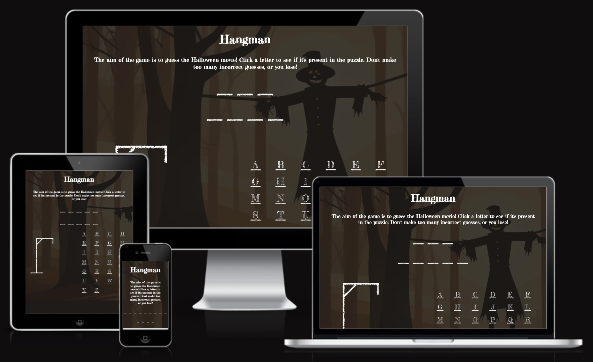
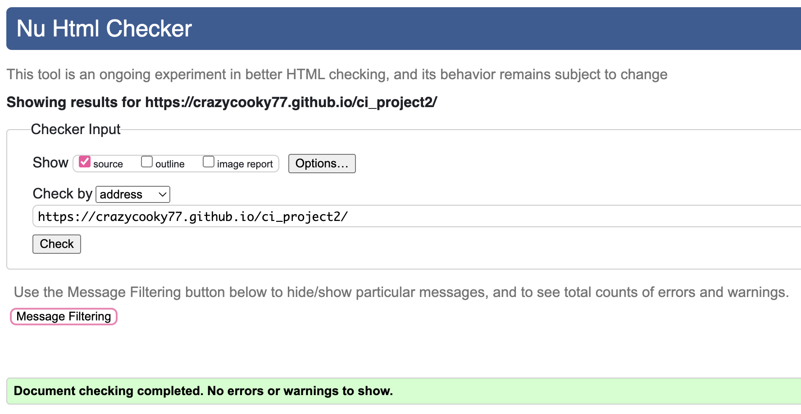
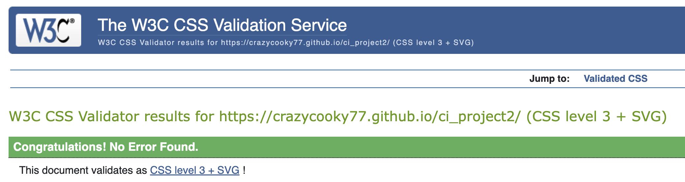
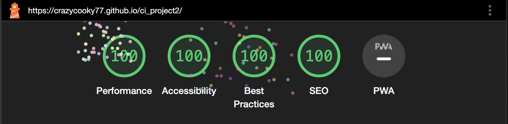
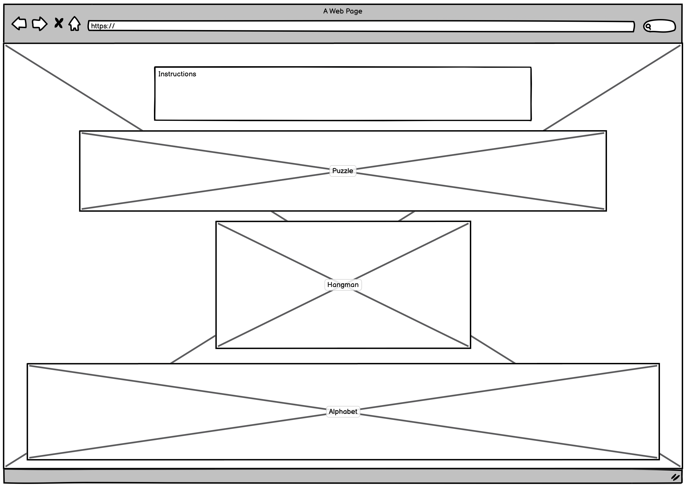

# Hangman Game

This site is for anyone who loves Hangman and Halloween! The game randomly selects a Halloween movie from a list and presents the user with blanks for each letter in the movie. The user selects letters from the alphabet provided, and the game will either fill in the blank, if the letter is in the movie name, or add a body part to the hangman! Once all body parts have been added to the hangman, the user loses. Once the user figures out the movie name (without killing the hangman), they win! Many more puzzle options can easily be added to the list, so the user can play as many times as they want, and hopefully not get bored long-term.

1. [User Stories](#user-stories)
2. [Features](#features)
3. [Testing](#testing)
4. [Deployment](#deployment)
5. [Credits](#credits)
6. [Media](#media)

## User Stories

- As a user, I want to be able to play Hangman by myself.

- As a user, I want to be able to have lots of different puzzles in the Hangman game.

- As a user, I want to be able to easily start a new game when the previous one ends.

## Features 

- __Background Image__ should show users that the site is Halloween-themed.\
[View image (CTRL/CMD+Click for a new tab) by clicking here](https://github.com/crazycooky77/ci_project2/blob/hangman/assets/images/background.webp)

- __New Game Page__ let's the user interact on first loading the page to start a new game when they're ready.\
[View image (CTRL/CMD+Click for a new tab) by clicking here](https://github.com/crazycooky77/ci_project2/blob/hangman/assets/images/readme-new-game.webp)

- __Puzzle Page__ has instructions for the game, the blank puzzle area for the movie the user needs to guess, the hangman image to track incorrect letter selections, and the alphabet for the user to interact with to select a letter and keep track of what they already guessed.\
[View image (CTRL/CMD+Click for a new tab) by clicking here](https://github.com/crazycooky77/ci_project2/blob/hangman/assets/images/readme-puzzle.webp)

- __Game Over Page__ is used to redirect the user when they make too many incorrect guesses. They can start a new game from this page to try again.\
[View image (CTRL/CMD+Click for a new tab) by clicking here](https://github.com/crazycooky77/ci_project2/blob/hangman/assets/images/readme-game-over.webp)

- __Winner Winner Hangman's Dinner__ is the page the user is redirected to when they correctly guess the movie without hanging the hangman. They can start a new game from here as well.\
[View image (CTRL/CMD+Click for a new tab) by clicking here](https://github.com/crazycooky77/ci_project2/blob/hangman/assets/images/readme-winner.webp)

## Testing 
1. Used Wave on each page and corrected missing alt tags where needed
2. Tested the site with Lighthouse and replaced all .png images with .webp
3. Full site functionality was tested on a MacBook, iPad, iPhone, and Pixel 6
	3a. New Game page and button
	3b. Lost Game page and New Game button
	3c. Won Game page and New Game button
	3d. Puzzle Page with all alphabet letters and new/lost games
4. HTML Checker identified an unclosed element > resolved
5. W3C Validator identified no issues to resolve

### Validator Testing 

#### HTML Checker
The page was checked using the HTML Checker. Identified errors and warnings were resolved. No other errors/warnings remain.

#### W3C
All pages were checked using [the Jigsaw W3 Validator](https://jigsaw.w3.org/css-validator/#validate_by_uri) and no errors were found as evidenced on [this page](https://jigsaw.w3.org/css-validator/validator?uri=https%3A%2F%2Fcrazycooky77.github.io%2Fci_project2%2F&profile=css3svg&usermedium=all&warning=1&vextwarning=&lang=en) and via the image below.

#### Lighthouse
The website was checked using Lighthouse and 100 was scored in all areas.

#### Wave
Wave does not show show errors on any of the pages. It does display an alert for a possible heading, however the text is in paragraph tags, and stylistically, the font size is as expected.

## Deployment

The site was deployed to GitHub Pages via the following steps:
1. Created a new branch in [my own repository](https://github.com/crazycooky77/ci_projects) that already included the [Code Institute template](https://github.com/Code-Institute-Org/ci-full-template)
2. Used GitHub Desktop for file updates and commits to the [hangman branch](https://github.com/crazycooky77/ci_projects/tree/hangman)
3. Noted issues (see below) when trying to deploy to GitHub Pages
4. Followed steps outlined below in Issues
5. Opened Settings for [the new repository](https://github.com/crazycooky77/ci_project2)
6. Clicked Pages from the left sidebar
7. Chose to "Deploy from a branch" for the Source
8. Selected the hangman branch for this project and clicked "Save"

### Issues

A GitHub Pages site could not be generated from the [original repository](https://github.com/crazycooky77/ci_projects/tree/hangman), as only 1 can be created per repository, and the first project page was already in use from a different branch. Therefore, the repository, including the full commit history, was copied to the [new repository](https://github.com/crazycooky77/ci_project2) now in use for the later commits, and the GitHub Pages deployment. The full steps, including creating the SSH key to enable to necessary commands, are below.

In Terminal:
1. cd .ssh/
2. ssh-keygen
3. cat -GITHUB_PASSWORD-
4. cat id_rsa.pub
Browser:
5. [github.com > Settings > SSH and GPG keys](https://github.com/settings/keys)
6. New SSH key
7. Copy/paste the result from Terminal in step 4
8. Add SSH key
Terminal:
9. git remote add ci_projects2 git@github.com:crazycooky77/ci_project2.git
10. git push -u ci_projects2 hangman

## Credits 

### Content 

- The base template was cloned from the [Code Institute GitHub repository](https://github.com/Code-Institute-Org/ci-full-template)
- The basic readme and HTML templates were copied from [CluelessBiker's mentoring repository](https://github.com/CluelessBiker/mentoring/tree/main)
- Font used from [Google Fonts](https://fonts.google.com/specimen/Fredericka+the+Great)
- Background image was AI-generated from [Stable Diffusion](https://github.com/AUTOMATIC1111/stable-diffusion-webui)

## Media

### Wireframes

I created a basic wireframe to plan out the layout for the website. 
